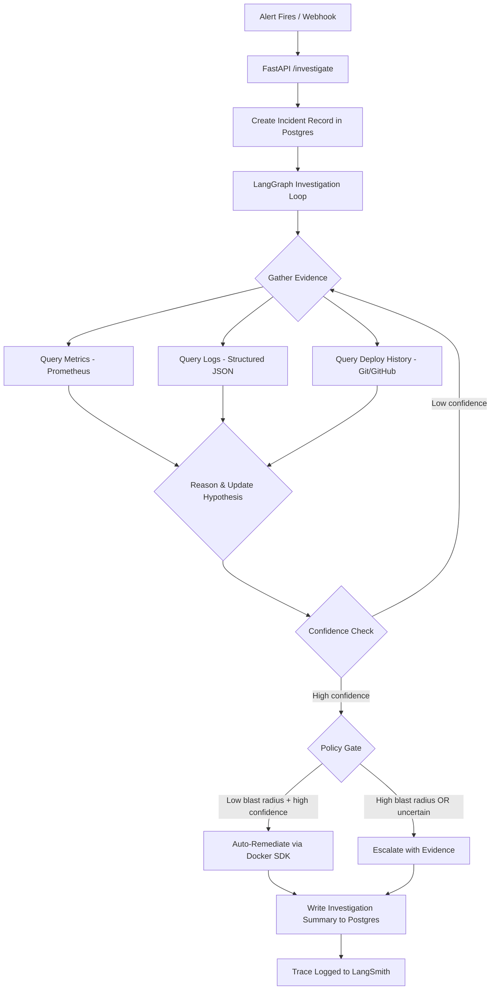
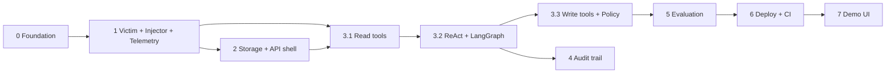

# Architecture — SRE Incident Triage Agent

## Overview

This system is an AI-powered SRE agent that automates the initial triage phase of incident response. When an alert fires, the agent investigates by querying logs, metrics, and deploy history — the same signals a human on-call engineer would check — and produces a diagnosis with cited evidence. For low-risk, high-confidence scenarios, it auto-remediates. For everything else, it escalates with a full investigation trail.

## System Data Flow

## Components

### 1. Victim System (Environment)
Three small Python/FastAPI services simulating a real microservices environment:
- **api-gateway** → routes requests, injectable timeout fault
- **data-service** → business logic, injectable bad-config fault
- **downstream-dep** → external dependency, injectable latency/memory fault

Each exposes `/health`, `/metrics` (Prometheus format), and `/admin/fault` (injection control).

### 2. Fault Injector
CLI tool that triggers a specific fault on a specific service and logs ground truth (fault type, target, timestamp) for evaluation scoring.

### 3. Telemetry
- **Prometheus** scrapes `/metrics` from all services (request latency, error rates, resource usage)
- **Structured JSON logs** written to stdout by each service
- **Git/GitHub API** provides deploy/commit history for the repo

### 4–5. Agent Core (ReAct Loop + LangGraph)
A LangGraph state machine implementing a ReAct-style investigation:
- **State:** current alert, evidence collected, hypothesis, confidence score, step count
- **Nodes:** gather_evidence → reason → decide
- **Edges:** conditional routing based on confidence level and policy table

*Diagram will be added after Phase 3 build — the LangGraph state machine diagram is the most valuable visual in this document.*

### 6. Tool/Action Layer
**Read tools (always safe):** query_metrics, query_logs, query_deploy_history
**Write tools (policy-gated):** restart_service, rollback_deploy, toggle_config

Each action has a hardcoded blast-radius classification (low/medium/high) and a confidence threshold. The policy gate is deterministic — no LLM involvement in the safety decision.

### 7. Storage (Supabase / Postgres)
- `incidents` table: triggered faults with ground truth
- `investigations` table: agent diagnoses, actions, cost, latency, evidence

### 8. Audit Trail
- **LangSmith:** full step-by-step reasoning traces, tagged by incident_id
- **Postgres:** queryable summary records per investigation (diagnosis, cost, latency, correctness)

### 9. Evaluation Harness
Deterministic scoring against ground truth:
- Injects known faults → runs agent → compares diagnosis and action against expected outcome
- Tracks: diagnosis accuracy, false-autonomous-action rate, cost per investigation, latency

### 10. API Layer (FastAPI)
- `POST /investigate` — accepts Alertmanager-shaped webhook, triggers investigation
- `GET /investigations/{id}` — returns investigation summary

### 11. Deployment
Docker Compose on Fly.io (free tier), GitHub Actions CI/CD on push to main.

### 12. Demo UI (React)
Two pages: investigation trigger + live view, and history/eval dashboard.

## Build Order

The order below is **dependency-driven, not calendar-driven**: each stage exists where it does
because the stage after it cannot be built — or cannot be honestly measured — until it lands.
Phase numbers match the roadmap in `README.md`; the `§n` references point at the numbered
components above.

**Status legend:** ✅ Completed · 🔄 In Progress · ⬜ Upcoming

### Stage 0 — Foundation ✅

**Gate:** none — this is the floor. Everything below assumes a single Compose stack and one
`.env` contract.

| Item | Depends on | Status |
|---|---|---|
| Repo layout (`services/`, `agent/`, `injector/`, `eval/`, `api/`) | — | ✅ |
| Root `docker-compose.yml` | — | ✅ |
| `.env` contract shared by services, agent, and injector | — | ✅ |

### Stage 1 — The environment under test ✅

**Gate:** an agent cannot be built against signals that do not exist, and a diagnosis cannot be
scored against a fault that is not reproducible. Order *inside* the stage matters too:
Prometheus needs `/metrics` endpoints to scrape, and the injector needs `/admin/fault` to call.

| Item | Depends on | Status |
|---|---|---|
| §1 Victim services (`api-gateway`, `data-service`, `downstream-dep`) | Stage 0 | ✅ |
| §2 Fault injector + traffic generator + deploy seeder | §1 `/admin/fault` | ✅ |
| §3 Prometheus scraping + structured JSON logs | §1 `/metrics` | ✅ |

### Stage 2 — Persistence and the API shell ✅

**Gate:** Stage 3 should *fill in* an investigation row, not also have to invent the plumbing
around it. The `deploys` ledger belongs here rather than in Stage 3 because
`query_deploy_history` reads it from Postgres — the data has to exist before the tool that
queries it.

| Item | Depends on | Status |
|---|---|---|
| §7 `incidents` + `investigations` tables (`supabase/migrations/`) | Stage 0 | ✅ |
| §7 `deploys` ledger | `incidents` schema | ✅ |
| §10 `POST /investigate` + `GET /investigations/{id}` (shell, no agent logic) | §7 | ✅ |

### Stage 3 — Agent core (Phase 3) 🔄

**Gate:** the tools come before the loop, and the loop before the gate that consumes its output.
Each sub-phase is proven against the live stack before the next one assumes it works.

| Item | Depends on | Status |
|---|---|---|
| 3.1 Read tools — `query_metrics`, `query_logs`, `query_deploy_history` (§6) | Stages 1 + 2 | ✅ |
| 3.2 ReAct loop + LangGraph orchestration (§4, §5) | 3.1 | 🔄 |
| 3.3 Write tools + deterministic policy gate (§6) | 3.2 | ⬜ |
| Wire the graph into `POST /investigate` and persist the report | 3.3 + Stage 2 | 🔄 |

- **3.1's gate:** every tool individually exercisable against the live stack during a real
  injected fault (`python -m agent.tools.probe`) before the loop ever calls one.
- **3.2 is In Progress, not Completed.** The loop is built and fully tested offline but has
  never made a real API call; the live four-fault rehearsal is outstanding, and until it passes
  the loop is unproven.
- **3.3 depends on 3.2** because the policy gate consumes the *validated* confidence score that
  `decide` produces — not the model's self-reported number.
- **The wiring row was built during Stage 4**, because persisting a per-investigation summary
  and running the graph from the endpoint are the same job. `POST /investigate` now marks the
  row `running`, investigates in a background task and writes the report back. Offline-tested
  against a fake investigator; the endpoint has still never run the real graph.

### Stage 4 — Audit trail 🔄

**Gate:** there are no traces until there are runs. Instrumenting a loop that has never executed
measures nothing. That gate is satisfied — the loop has run live roughly a dozen times across
Days 12–14.

| Item | Depends on | Status |
|---|---|---|
| §8 LangSmith tracing tagged by `incident_id` | 3.2 | 🔄 |
| §8 Postgres per-investigation summary (diagnosis, cost, latency) | 3.2 + Stage 2 | 🔄 |

- **Both rows are built and tested offline; neither has been proven live.** The stage's own
  exit condition is one traced run that reaches both LangSmith and Postgres through
  `POST /investigate`, and it has not been run. Applying the same standard 3.2 is held to.
- **Stage 4 does not depend on 3.2's open `timeout` gate.** The trail records what happened,
  right or wrong; a readable trace is precisely what Day 14's three poisoned runs lacked.

### Stage 5 — Evaluation ⬜

**Gate:** three things must be true at once — a loop that terminates (3.2), a policy gate to
measure false-autonomous-action rate against (3.3), **and** ground truth in Postgres. Ground
truth currently lives only in `injector/ground_truth.jsonl`, which makes the injector
dual-write a hard blocker on this stage.

| Item | Depends on | Status |
|---|---|---|
| §9 `eval/run_eval.py` harness | 3.3 | ⬜ |
| Scenario definitions (`eval/scenarios/`) | Stage 1 | ✅ |
| Ground-truth dual-write to Postgres | §2 injector | ⬜ (blocking) |
| Scoring: accuracy, false-autonomous-action rate, cost, latency | harness + ground truth | ⬜ |

### Stage 6 — Deployment & CI/CD ⬜

**Gate:** CI runs the eval, so the eval must exist first. This stage is also where the
`/var/run/docker.sock` mount that `query_logs` depends on has to be resolved — it cannot work
on Fly.io. That is a decision this stage is forced to make deliberately, not a surprise to
discover on first deploy.

| Item | Depends on | Status |
|---|---|---|
| §11 Fly.io deployment | Stage 5 | ⬜ |
| §11 GitHub Actions CI/CD (`.github/workflows/`) | Stage 5 | ⬜ |
| Replace the Docker-socket log path for a hosted environment | §6 `query_logs` | ⬜ |

### Stage 7 — Demo UI ⬜

**Gate:** last because it only consumes. It renders `GET /investigations/{id}` and the eval
results; it produces nothing anything else depends on.

| Item | Depends on | Status |
|---|---|---|
| §12 Investigation trigger + live view | Stage 3 wiring | ⬜ |
| §12 History / eval dashboard | Stage 5 | ⬜ |

### Polish ⬜

| Item | Depends on | Status |
|---|---|---|
| Populate `Decisions & Trade-offs` below from `docs/decisions.md` | all stages | ⬜ |
| Fill in `README.md`'s results table | Stage 5 | ⬜ |

### Sequenced but unscheduled

Cross-cutting work that is not phase-bound but must land before a named stage. Each row is
tracked in `CLAUDE.md`'s Known Issues.

| Item | Must land before | Why |
|---|---|---|
| api-gateway handles 5xx from data-service (→ 502 + structured log + metric) | Stage 5 | Uncounted 500s and raw tracebacks distort the eval signal |
| Injector dual-writes ground truth to Postgres | Stage 5 | **Blocking** — the harness has nothing to score against |
| `since`/`until` anchoring on the opening sweep's metric and log calls | Stage 5 | Replayed (non-live) incidents currently read the wrong window |
| `agent-api` exposes `/metrics` + a Prometheus scrape target | Stage 6 | The agent is unobservable in a deployed stack |
| Alertmanager container + alerting rules | Stage 6 | `POST /investigate` is exercised with fixtures, not live alerts |
| Prometheus TSDB volume at `/prometheus` | Stage 6 | History dies on `docker compose down`; empty results read as "no traffic" |

---

## Decisions & Trade-offs

*This section will be populated from `docs/decisions.md` as the project progresses. Each entry will cover: the decision, what alternatives were considered, and why this choice was made.*

<!-- Add entries here after each phase -->
