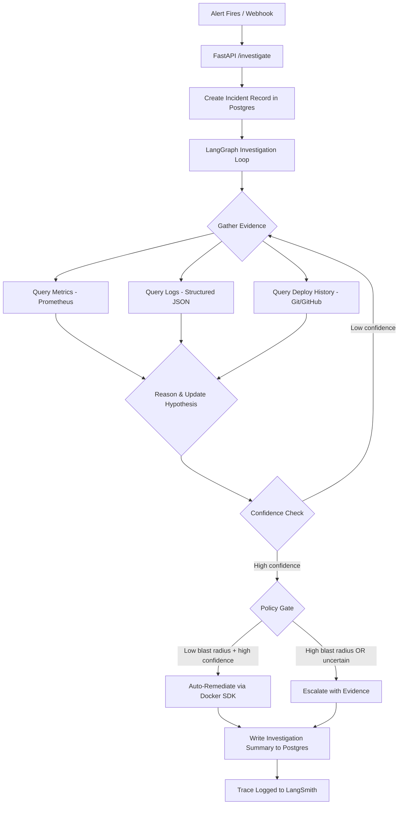

# Architecture — SRE Incident Triage Agent

## Overview

This system is an AI-powered SRE agent that automates the initial triage phase of incident response. When an alert fires, the agent investigates by querying logs, metrics, and deploy history — the same signals a human on-call engineer would check — and produces a diagnosis with cited evidence. For low-risk, high-confidence scenarios, it auto-remediates. For everything else, it escalates with a full investigation trail.

## System Data Flow

## Components

### 1. Victim System (Environment)
Three small Python/FastAPI services simulating a real microservices environment:
- **api-gateway** → routes requests, injectable timeout fault
- **data-service** → business logic, injectable bad-config fault
- **downstream-dep** → external dependency, injectable latency/memory fault

Each exposes `/health`, `/metrics` (Prometheus format), and `/admin/fault` (injection control).

### 2. Fault Injector
CLI tool that triggers a specific fault on a specific service and logs ground truth (fault type, target, timestamp) for evaluation scoring.

### 3. Telemetry
- **Prometheus** scrapes `/metrics` from all services (request latency, error rates, resource usage)
- **Structured JSON logs** written to stdout by each service
- **Git/GitHub API** provides deploy/commit history for the repo

### 4–5. Agent Core (ReAct Loop + LangGraph)
A LangGraph state machine implementing a ReAct-style investigation:
- **State:** current alert, evidence collected, hypothesis, confidence score, step count
- **Nodes:** gather_evidence → reason → decide
- **Edges:** conditional routing based on confidence level and policy table

*Diagram will be added after Phase 3 build — the LangGraph state machine diagram is the most valuable visual in this document.*

### 6. Tool/Action Layer
**Read tools (always safe):** query_metrics, query_logs, query_deploy_history
**Write tools (policy-gated):** restart_service, rollback_deploy, toggle_config

Each action has a hardcoded blast-radius classification (low/medium/high) and a confidence threshold. The policy gate is deterministic — no LLM involvement in the safety decision.

### 7. Storage (Supabase / Postgres)
- `incidents` table: triggered faults with ground truth
- `investigations` table: agent diagnoses, actions, cost, latency, evidence

### 8. Audit Trail
- **LangSmith:** full step-by-step reasoning traces, tagged by incident_id
- **Postgres:** queryable summary records per investigation (diagnosis, cost, latency, correctness)

### 9. Evaluation Harness
Deterministic scoring against ground truth:
- Injects known faults → runs agent → compares diagnosis and action against expected outcome
- Tracks: diagnosis accuracy, false-autonomous-action rate, cost per investigation, latency

### 10. API Layer (FastAPI)
- `POST /investigate` — accepts Alertmanager-shaped webhook, triggers investigation
- `GET /investigations/{id}` — returns investigation summary

### 11. Deployment
Docker Compose on Fly.io (free tier), GitHub Actions CI/CD on push to main.

### 12. Demo UI (React)
Two pages: investigation trigger + live view, and history/eval dashboard.

---

## Decisions & Trade-offs

*This section will be populated from `docs/decisions.md` as the project progresses. Each entry will cover: the decision, what alternatives were considered, and why this choice was made.*

<!-- Add entries here after each phase -->
